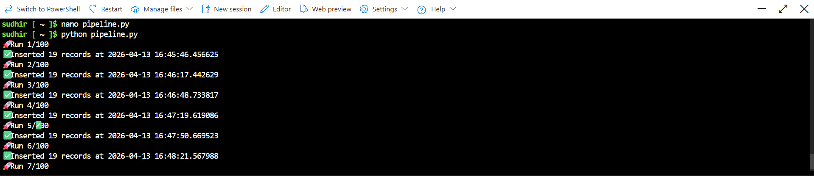
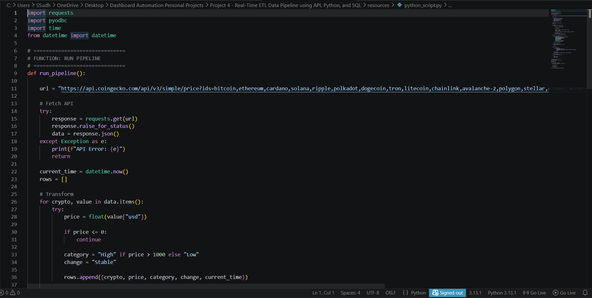
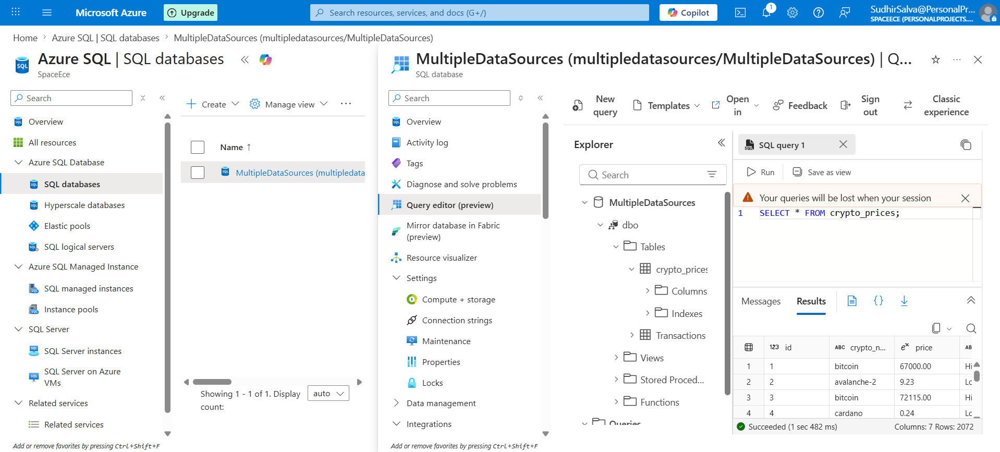
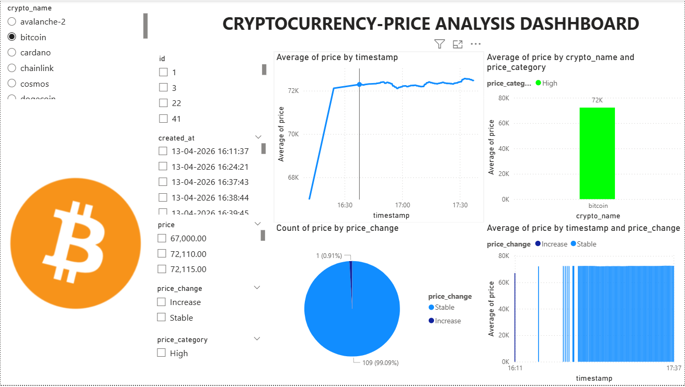
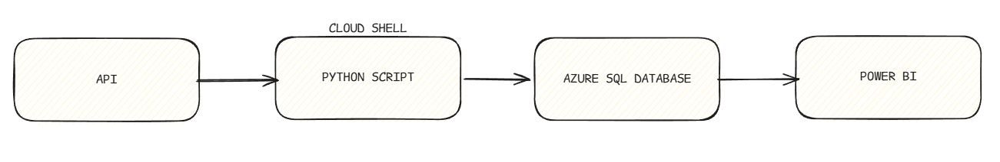

# PROJECT 4 : Real-Time ETL Data Pipeline using API, Python, and SQL

## Description
this is my fourth project where in my last project i used python script as one of the data sources for data generation and as api thereby but in this project i have taken the data live from an api online and then transformed the data using python script in azure cloudshell and sent the data live to the azure online sql database

---

## what are the tools used by me ?

### 1) API
it refers to Application Programming Interface where we use it to take the data live from various sources and it acts as a bridge for communication

---

### 2) Azure Cloudshell
it is a space in azure to connect and interact with the sql databases live being as a part of the azure environment securely

---

### 3) Python Script
it is used to transform the data live while sending the data from the api to the sql database in azure by adding columns and categories and transforming the data

---

### 4) Azure SQL database
it is used to store the data live into the database which is coming from the api in the online servers

---

### 5) Power BI
it is used to create dashboard and analyse the existing data in azure sql database by fetching the data live using direct query mode

---

## what is the dataflow ?

-> the data is collected live from the api first  
-> the data is then transformed using python script in azure cloudshell  
-> the data is stored in azure sql database  
-> the data in sql database is analysed using power bi as dashboard  

---

## what is my final learning in this project ?

this project helped me understand that not only data movement in pipelines is important but also the data should be structured properly and should have a clear final takeaway when used for further steps

---

## project resources

Screenshots :

[./screenshots/](./screenshots/)

Resources :

[./resources/](./resources/)
